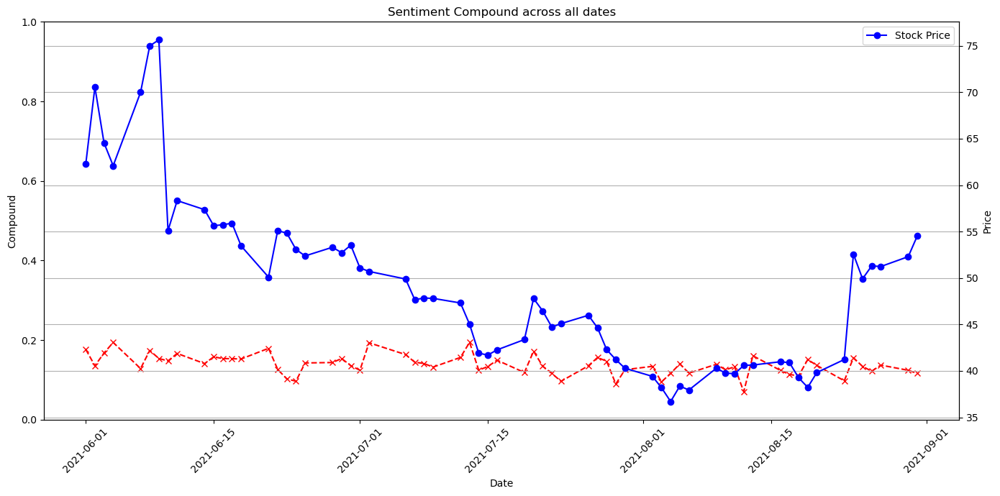

# 94812 Applications of NL(X) and LLM
# (Individual) Programming Assignment: Stock Price Prediction and GameStop Short Squeeze
Author: Yi-Hsueh (Alex) Yang

## Data Source

**Stock Data:** Gathered using the `yfinance` package, tickername set to `GME`, two date ranges are collected: 

- 2021-01-01 to 2021-09-01 for all-time data
- 2021-06-01 to 2021-09-01 for the forecasting timeframe 

**Sentiment Data:** Gathered from [Harvard Dataverse](https://dataverse.harvard.edu/dataset.xhtml?persistentId=doi:10.7910/DVN/TUMIPC) (rGME_dataset_features.csv)

Stock Price for the 2 ranges of time:

## Methodology

### Column Selection

I am predicting the close stock price for each day, so I'm using the `Close` column primarily in the stock dataset. As for the sentiment data, the average of `compound` grouping by date is used to represent the overall sentiment of a single day.

### Splitting Data

The stock market does not operate every day from June to August, so we are using only **business day** here in the analysis.  
The data is split into three chunks: train, validation, and test:

- Training data range from the beginning of the dataset to around mid-May
- Testing data range from 58 days before the end of August (aiming to predict business days from June 2021 to August 2021)
- Validation data ranging from mid-May to around late May.

### Preprocessing to Stock Price Data

The price data is scaled with `MinMaxScaler` with a range [0,1], then plugged into a function to create sequences of 20-day lookback for the input of the LSTM model. 
Since lookback is considered a hyperparameter here in this scenario, any number between 7 to 30 would make sense due to the nature that it can capture weekly and monthly trends if there are any. The chosen of 20 is due to the size of our total data, we are predicting into the future of three months, which is about 60 days of business day, making the size of our training and validation data about 80 and 15, hence, doing 20 instead of 30 will prevent us having limited data that might lead to underfitting in our prediction model.

### Preprocessing to Sentiment Data

The dataset is pretty clean and has numerous results from NLP analysis included, e.g. `neg`, `neu`, and `pos`. The score is calculated by VADER with a customized dictionary and 57 meta-features generated by a spaCy large English model. Instead of these three columns, I am using `compound` in this analysis as it is calculated based on the `neg`, `neu`, and `pos` scores.  
There are numerous `compound` scores each day, for modeling convenience, the average `compound` score for each day is used in this analysis.

### Model Structure

LSTM is chosen in this analysis as it is the one that is widely accepted in the field of time series analysis. I am using 3 LSTM layers, a fulling connected layer, and an output layer for the model. Three different loss functions are used for three different datasets, e.g. MSE, MAE, and RMSE.

### Initial Results of LSTM on Stock Price

| Model    | Train Error | Val Error | Test Error |
| -------- | ----------- | --------- | ---------- |
| MSE	    |0.024 	     |0.046   	|  0.005     |
| MAE	 	 |0.105   	  |0.180   	 | 0.045     |
| RMSE     |0.112   	  |0.246   	 | 0.093     |

The lookback day is 20, hence the predictions look fairly smooth compared to the historical data. Due to the nature of how the data is split, more fluctuations seem to happen in the training set and more tranquility is discovered in the testing set, the training error is always greater than the testing error for the first three models no matter which loss function I use.  

### Compare the Stock Price with the Sentiment Score

There is no obvious trend or correlation between the movement of stock price and sentiment score here, but this only accounts for the period between June and August, we can try to combine two data and apply the prediction model to it and see whether it is more accurate than the previous model.

## Results

After combining the data, the model looks much better than the previous one with low train and val errors and slightly higher test errors. We can also tell that after encapsulating both stock price data and sentiment data, the error has dropped tremendously compared to our base model, meaning that we are having a better here.

| Model    | Train Error | Val Error | Test Error |
| -------- | ----------- | --------- | ---------- |
| MSE	    |0.011	     |0.091   	|  0.014      |
| MAE	 	 |0.058   	  |0.167  	 | 0.050     |
| RMSE     |0.067   	  |0.227   	 | 0.082     |

### Testing Model Sensitivity by Observing Changes when Spikes Injected

The last three models were trained on a combined dataset with spikes, we can see from the graph that the rank of sensitivity towards extreme values for loss function is RMSE > MSE > MAE. All of them predict differently as there is no spike at all, so we can conclude that the model can reflect on the changes in sentiment scores. That being said, the short-term rise in sentiment on social media has the power to affect the stock price and the effect is pretty effective and timely. This is really different from traditional stock price prediction where only price data were used but neglected many other external factors that have a pretty strong ability to affect the stock price. 

.png)
.png)
.png)

## Insights Gained from the Analysis

LSTM is a model that can capture trends and remember long-term fluctuations, which does a fairly good job in this analysis. However, the day of lookback and the way to create sequences is something that can heavily affect the result of the model. Acknowledging the shape of the input data is super important for this task since the LSTM model is still going to work even if the shape is set wrongly, but we will end up getting a super good model that overlaps the ups and downs of the stock price which is too good to be true.  
This analysis shows the power of sentiment on social media on the stock price. It is fast and effective in a sense. Therefore, for future research in improving the performance of stock price prediction, the volume on social media (X, Facebook, etc.) is definitely something one shouldn't miss. Considering the speed of message transmission compared to monthly or annual fiscal reports of the company, the changes on social media have the potential to affect stock prices in a timely manner. However, once more and more people know about the importance of this now, it is relatively simple for people to manipulate the social volume in order to control the stock price which is hard to prevent, hence, the way of filtering out noises and irrelevant voices is perhaps a critical issue in the field of stock price prediction in the future.

### Appendix

Chat History with generative AI tool:  https://docs.google.com/document/d/1Y73wwwDjDoc02IOlX7LJFrknuao56SnUSLTcmSAZ2xI/edit?usp=sharing
